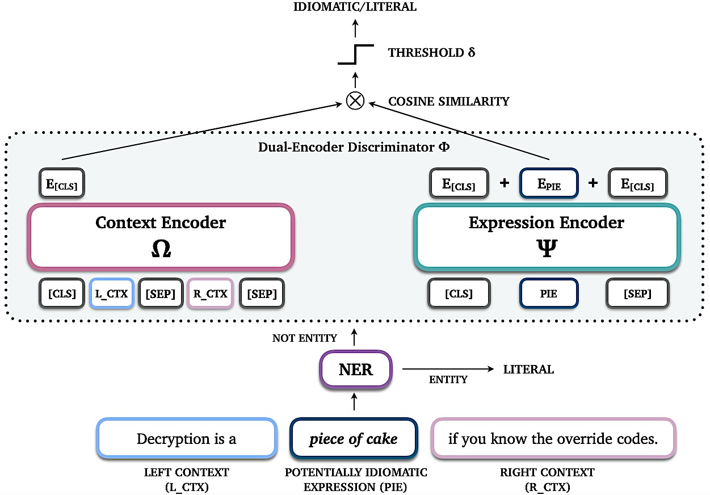

# **N**amed **E**ntity **R**ecognition for **I**diomaticity **D**etection

<p align="center">
  
</p>

Official repository for the paper [NER4ID at SemEval-2022 Task 2: Named Entity Recognition for Idiomaticity Detection](https://www.researchgate.net/publication/360541089_NER4ID_at_SemEval-2022_Task_2_Named_Entity_Recognition_for_Idiomaticity_Detection).

--------------------------------------------------------------------------------

**Please consider citing our work if you use data and/or code from this repository.**

#### Bibtex
```bibtex
@inproceedings{tedeschi-navigli-2022-ner4id,
    title = "{NER}4{ID} at {S}em{E}val-2022 Task 2: Named Entity Recognition for Idiomaticity Detection",
    author = "Tedeschi, Simone  and
      Navigli, Roberto",
    booktitle = "Proceedings of the 16th International Workshop on Semantic Evaluation (SemEval-2022)",
    month = jul,
    year = "2022",
    address = "Seattle, United States",
    publisher = "Association for Computational Linguistics",
    url = "https://aclanthology.org/2022.semeval-1.25",
    doi = "10.18653/v1/2022.semeval-1.25",
    pages = "204--210",
    abstract = "Idioms are lexically-complex phrases whose meaning cannot be derived by compositionally interpreting their components. Although the automatic identification and understanding of idioms is essential for a wide range of Natural Language Understanding tasks, they are still largely under-investigated.This motivated the organization of the SemEval-2022 Task 2, which is divided into two multilingual subtasks: one about idiomaticity detection, and the other about sentence embeddings. In this work, we focus on the first subtask and propose a Transformer-based dual-encoder architecture to compute the semantic similarity between a potentially-idiomatic expression and its context and, based on this, predict idiomaticity. Then, we show how and to what extent Named Entity Recognition can be exploited to reduce the degree of confusion of idiom identification systems and, therefore, improve performance.Our model achieves 92.1 F1 in the one-shot setting and shows strong robustness towards unseen idioms achieving 77.4 F1 in the zero-shot setting. We release our code at https://github.com/Babelscape/ner4id.",
}
```
<br>

# System Overview 
In a nutshell, NER4ID is a high-performing idiom identification system that: i) uses Named Entity Recognition (NER) to pre-identify non-idiomatic expressions, and ii) exploits a novel Transformer-based dual-encoder architecture to compute the semantic similarities between the remaining potentially-idiomatic expressions and their contexts and, based on these, predict idiomaticity.

The following figure shows the overall architecture of our NER4ID system:
<br><br>

<center>



</center>

<br>


# Data
The datasets used to train and evaluate our NER4ID system are those provided by [SemEval-2022 Task 2](https://sites.google.com/view/semeval2022task2-idiomaticity) organizers. Each entry contains a multi-word expression (MWE) in context, and the aim of the system is to determine whether such MWE is used with a literal or idiomatic meaning in that context. Datasets are provided for three different languages: English, Portuguese and Galician.

Additionally, two different settings are available: zero-shot and one-shot.
In the "zero-shot" setting, MWEs (potentially idiomatic phrases) in the training set are completely disjoint from those in the test and development sets. In the "one-shot" setting, they included one positive and one negative training example for each MWE in the test and development sets.

The datasets are available in the [/data](./data) folder.

<br>

# Implementation
We implemented our idiom identification system with [PyTorch](https://pytorch.org/) using the [Transformers library](https://huggingface.co/docs/transformers/index) to load the weights of a BERT-based model.

We fine-tuned our idiom identification system for 100 epochs with a Mean-Squared Error loss criterion, adopting an early stopping strategy with a patience value of 20, Adam optimizer and a learning rate of 10-5, as standard when fine-tuning the weights of a pretrained language model. 
Additionally, we set δ=0, and use 32 as batch size, with 4 steps of gradient accumulation. 

To identify entities, instead, we employed [wikineural-multilingual-ner](https://huggingface.co/Babelscape/wikineural-multilingual-ner), a Multilingual BERT (mBERT) model fine-tuned on the [WikiNEuRal](https://github.com/babelscape/wikineural) dataset. We compare systems by means of their Macro F1 scores, as specified by the competition rules.

We provide a **[Python Notebook](./code/NER4ID.ipynb)** that illustrates all the modules that characterize the NER4ID system.
For ease of use, we simplify the notebook in the following points:
- Instead of using *BERT-base-cased* for English and of *BERT-base-portuguese-cased* for Portuguese and Galician, we use a single BERT-base-multilingual-cased model;
- Rather than ensembling the predictions of 9 model checkpoints, we consider the predictions only of the best model;
- To identify entities, we use rely on commonly-used SpaCy NER tagger.

For further implementation details, please refer to the paper.

<br>

# License 
NER4ID is licensed under the CC BY-SA-NC 4.0 license. The text of the license can be found [here](https://github.com/Babelscape/ner4id/LICENSE).


<br>

# Acknowledgments
We gratefully acknowledge the support of the **ERC Consolidator Grant MOUSSE No. 726487** under the European Union’s Horizon2020 research and innovation programme ([http://mousse-project.org/](http://mousse-project.org/)).
